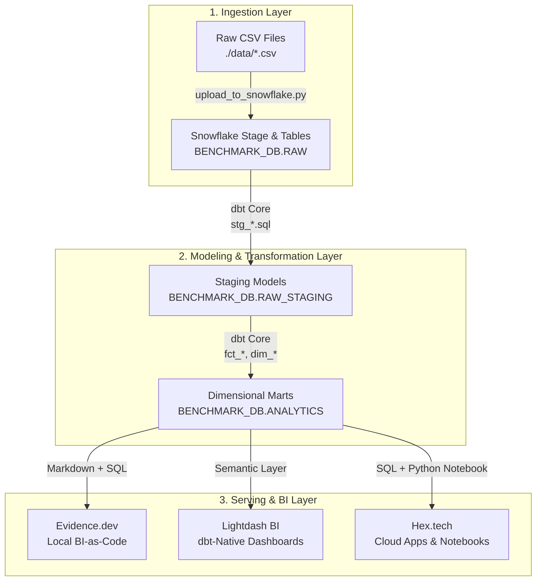

# 🏢 Enterprise BI-as-Code & Data Platform Benchmark

[](https://www.snowflake.com/)
[](https://www.getdbt.com/)
[](https://evidence.dev/)
[](https://www.lightdash.com/)
[](https://hex.tech/)

Une plateforme d'ingestion, de transformation et de restitution décisionnelle de niveau entreprise (*Enterprise-Grade*), conçue pour comparer et bencher les approches **BI-as-Code** (Evidence.dev) vs **dbt-Native BI** (Lightdash) vs **Collaborative Data Workspace** (Hex.tech) au-dessus de **Snowflake Data Cloud**.

---

## 📐 Architecture Réseau & Flux de Données



---

## 📂 Structure du Répertoire d'Entreprise

```
actual_bi_as_code_benchmark/
├── README.md                              # Documentation principale du projet
├── data/                                  # Couche d'Ingestion
│   ├── raw_agences.csv                    # Données Agences
│   ├── raw_candidats.csv                  # Données Candidats
│   ├── raw_clients.csv                    # Données Clients
│   ├── raw_crm_leads.csv                  # Données CRM & Prospects
│   ├── raw_finance_factures.csv           # Facturation & CA
│   ├── raw_missions.csv                   # Missions & Placements
│   ├── raw_paie_interimaires.csv          # Paie & Heures
│   ├── generate_actual_data.py            # Générateur de données de synthèse
│   └── upload_to_snowflake.py             # Script Python d'injection Snowflake
├── dbt_project/                           # Couche de Transformation dbt Core
│   ├── dbt_project.yml                    # Configuration dbt
│   ├── profiles.yml                       # Profil de connexion Snowflake dbt
│   └── models/
│       ├── staging/                       # Modèles de nettoyage (STG)
│       └── marts/                         # Modèles dimensionnels (FCT & DIM)
├── evidence_actual/                       # Restitution BI-as-Code (Evidence.dev)
│   ├── package.json                       # Dépendances Node.js & Snowflake
│   ├── evidence.config.yaml               # Configuration Evidence
│   └── pages/                             # Rapports Markdown + SQL
└── docs/                                  # Documentation Technique Enterprise
    ├── GUIDE_SETUP_BENCHMARK_SNOWFLAKE_EVIDENCE_HEX.md
    ├── LIGHTDASH_SNOWFLAKE_SETUP.md
    └── SNOWFLAKE_COST_SAFETY_GUIDE.md
```

---

## ⚡ Démarrage Rapide (Quick Start)

### 1. Ingestion des données dans Snowflake
```bash
# Ingestion des 7 tables brutes dans BENCHMARK_DB.RAW
/usr/bin/python3 "data/upload_to_snowflake.py"
```

### 2. Exécution des transformations dbt
```bash
cd dbt_project
dbt debug
dbt run
```

### 3. Lancement du serveur BI-as-Code Evidence.dev
```bash
cd ../evidence_actual
npm install
npm run dev
# Rapport accessible sur http://localhost:3000
```

---

## 📑 Guides Techniques & Documentation

Pour la mise en service et la gouvernance complète de la plateforme, consultez les guides dans `docs/` :

* 📘 [**Guide d'Intégration Lightdash**](file:///Users/mohammedamine/AI%20engineer%20projects%20%28freelance%20Bicode%29/actual_bi_as_code_benchmark/docs/LIGHTDASH_SNOWFLAKE_SETUP.md)
* 📘 [**Guide Architecture Snowflake, Evidence & Hex**](file:///Users/mohammedamine/AI%20engineer%20projects%20%28freelance%20Bicode%29/actual_bi_as_code_benchmark/docs/GUIDE_SETUP_BENCHMARK_SNOWFLAKE_EVIDENCE_HEX.md)
* 🛡️ [**Guide de Sécurité Anti-Coûts Snowflake**](file:///Users/mohammedamine/AI%20engineer%20projects%20%28freelance%20Bicode%29/actual_bi_as_code_benchmark/docs/SNOWFLAKE_COST_SAFETY_GUIDE.md)

---

## 📊 Matrice de Comparaison des Solutions BI

| Critère | **Evidence.dev** | **Lightdash** | **Hex.tech** |
| :--- | :--- | :--- | :--- |
| **Paradigme** | BI-as-Code (MD + SQL) | dbt-Native BI (Semantic Layer) | Data Workspace (Notebook/App) |
| **Intégration dbt** | Fichiers SQL autonomes | Sync 100% native des `schema.yml` | Connecteur SQL direct |
| **Déploiement** | Local / Git / Vercel | Cloud / Self-Hosted Docker | Cloud SaaS |
| **Cas d'usage optimal** | Rapports statiques ultra-rapides | Dashboarding dbt pour Analysts | Data Science & Apps interactives |
