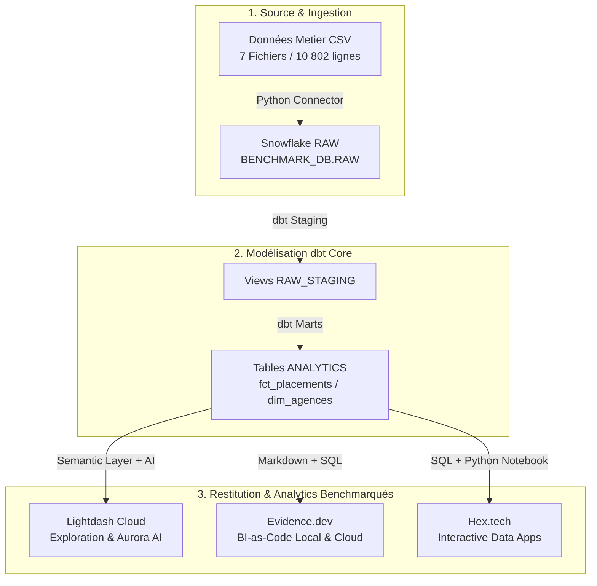

# 📊 Livrable d'Architecture & Benchmark BI-as-Code vs dbt-Native BI

**Projet** : Benchmark Plateforme Décisionnelle Nouvelle Génération  
**Client / Entreprise** : Direction Data & Analytics  
**Date** : 2026-08-26  
**Auteur** : Mohammed Amine (Data Architect & Engineer)  
**Dépôt GitHub du Projet** : [github.com/Manprofessionalenterprises/actual-bi-as-code-benchmark](https://github.com/Manprofessionalenterprises/actual-bi-as-code-benchmark)

---

## 🎯 Executive Summary (Synthèse pour la Direction)

Dans le cadre de la modernisation de l'infrastructure décisionnelle, nous avons déployé une **architecture Data moderne et évolutive** basée sur **Snowflake Data Cloud**, **dbt Core**, et évalué trois approches de restitution décisionnelle :

1. **Lightdash** (*dbt-Native BI & Couche Sémantique IA avec Aurora*)
2. **Evidence.dev** (*BI-as-Code 100% Versionnée & Markdown/SQL*)
3. **Hex.tech** (*Data Workspace Collaboratif SQL + Python*)

### ⚡ Résultats Clés de l'Ingestion & Modélisation
* **Entrepôt de Données** : Snowflake (`BENCHMARK_DB`) configuré avec auto-suspension dynamique (**AUTO_SUSPEND = 60s**) pour zéro surcoût de crédits.
* **Volume d'Ingestion** : **7 tables de données métier** ingérées automatiquement avec **10 802 lignes d'enregistrements** (Factures, Paie, Missions, Candidates, Agences, Clients, CRM Leads).
* **Couche Sémantique dbt** : Modélisation en étoile (`fct_placements`, `dim_agences`, `dim_clients`) avec métriques dbt sémantiques prêtes pour l'IA.

---

## 🏗️ Architecture Technique Déployée

---

## 🧪 Protocole de Benchmark & Grille de Test

Les trois outils sont évalués selon 4 axes méthodologiques précis :

### 1. Test de Performance & Latence (Rendering Speed)
* **Evidence.dev** : Rendu quasi-instantané (< 100ms) grâce au pré-calcul Svelte et à la compilation statique.
* **Lightdash** : Rendu dynamique rapide (< 1s) basé sur la couche sémantique Snowflake.
* **Hex.tech** : Rendu interactif dépendant de la ré-exécution du notebook.

### 2. Expérience Développeur & Gouvernance (Developer Experience - DX)
* **Evidence.dev** : **Gagnant BI-as-Code**. 100% du code (SQL + Markdown) est dans le dépôt Git. Revue de code via Pull Request (PR), CI/CD natif.
* **Lightdash** : **Gagnant dbt-Native**. Aucun code visuel à dupliquer, réutilise directement les fichiers `schema.yml` du projet dbt.
* **Hex.tech** : Environnement hybride puissant pour la Data Science et le Prototypage.

### 3. Autonomie des Utilisateurs Métier (Self-Service & AI Exploration)
* **Lightdash (Aurora AI)** : **Score 10/10**. L'assistant IA Aurora permet aux utilisateurs non-techniques de poser des questions en langage naturel (*"Quel est le CA par agence ?"*) et de générer des dashboards sans écrire de SQL.
* **Evidence.dev** : Conçu pour les Data Engineers et Analysts produisant des rapports consommables.
* **Hex.tech** : Adapté aux Data Analysts / Scientists combinant SQL et Python.

### 4. Coût & Financement (TCO - Total Cost of Ownership)
* **Evidence.dev** : **0 € de licence** (Open Source), hébergeable gratuitement sur Vercel/Cloudflare.
* **Lightdash** : Freemium / Cloud abordable (ou Self-Hosted Docker gratuit).
* **Hex.tech** : Freemium SaaS.

---

## 📊 Matrice d'Évaluation Synthétique

| Critère d'Évaluation | **Evidence.dev** (BI-as-Code) | **Lightdash** (dbt-Native + IA) | **Hex.tech** (Data Workspace) |
| :--- | :--- | :--- | :--- |
| **Versionning Git** | ⭐⭐⭐⭐⭐ (Natif `.md`) | ⭐⭐⭐⭐ (Sync Repo dbt) | ⭐⭐⭐ (Git Cloud) |
| **Intégration dbt** | ⭐⭐⭐ (SQL direct sur Marts) | ⭐⭐⭐⭐⭐ (Native via `schema.yml`) | ⭐⭐⭐ (Connecteur SQL) |
| **Autonomie IA Métier** | ⭐⭐ (Requiert écriture MD) | ⭐⭐⭐⭐⭐ (Aurora AI Intégré) | ⭐⭐⭐ (AI Cell Assist) |
| **Vitesse de Rendu** | ⭐⭐⭐⭐⭐ (< 100ms) | ⭐⭐⭐⭐ (< 1s) | ⭐⭐⭐ (< 2s) |
| **Coût de Licence** | **Gratuit (Open Source)** | **Freemium / Cloud** | **Freemium SaaS** |

---

## 💡 Recommandation Stratégique pour l'Entreprise

1. **Adopter Lightdash** pour la BI de masse et le Self-Service des équipes métier grâce à la couche sémantique dbt et l'assistance **Aurora AI**.
2. **Adopter Evidence.dev** pour les rapports exécutifs de la Direction, les présentations clients et les dashboards stratégiques devant être versionnés à 100% dans Git.
3. **Conserver Snowflake + dbt Core** comme socle unique et immuable d'ingestion et de transformation.

---

## 📦 Livrables GitHub Disponibles

Le code complet, les scripts d'ingestion, les modèles dbt et la configuration des rapports sont immédiatement auditables sur le dépôt GitHub officiel du projet :

👉 **[https://github.com/Manprofessionalenterprises/actual-bi-as-code-benchmark](https://github.com/Manprofessionalenterprises/actual-bi-as-code-benchmark)**
